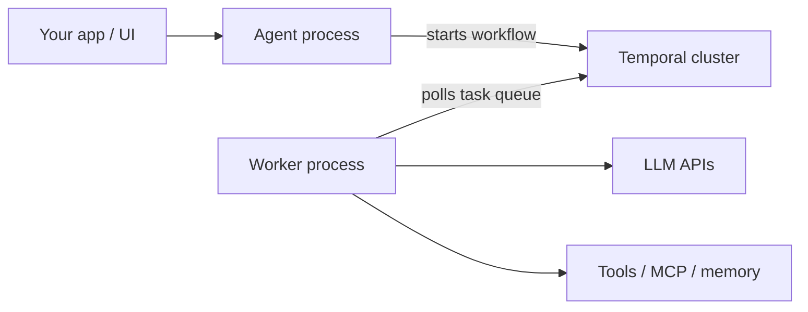

<Note>
**Temporal runtime.** `NewAgentWorker` and `DisableLocalWorker` apply to the [Temporal runtime](/runtimes/temporal). For Restate’s ingress + embedded endpoint topology, see [Restate runtime](/runtimes/restate).
</Note>

**The problem:** Your API or UI process needs to submit agent runs and stream results to users — but you don't want it to also host the worker that executes LLM calls and tools. Mixing both in one process couples your UI latency to compute load, limits independent scaling, and makes deploys riskier.

**The solution:** Split the agent client (submits runs, handles streaming and approvals in your API) and the worker (polls the task queue and executes everything else) into separate processes. Workers are stateless — all state is held by the runtime — so you can scale them independently, deploy them separately, and restart them without losing in-flight runs.

## Architecture



| Process | Role |
|---|---|
| **Agent** (`NewAgent` + `DisableLocalWorker`) | Starts `Run` / `Stream`; handles approvals in your UI |
| **Worker** (`NewAgentWorker`) | Polls the task queue; executes LLM calls, tools, memory, and approvals as Temporal activities |
| **Temporal** | Durable workflow history — survives crashes and deploys |

See [Temporal runtime](/runtimes/temporal) for the full architecture diagram.

## Setup

**Worker process** — polls the task queue and executes runs:

```go
w, err := agent.NewAgentWorker(
    temporal.WithTemporalConfig(&temporal.TemporalConfig{
        Host: "localhost", Port: 7233,
        Namespace: "default", TaskQueue: "my-app",
    }),
    agent.WithLLMClient(llmClient),
    agent.WithSystemPrompt("You are a helpful assistant."),
)
if err != nil {
    log.Fatal(err)
}

go func() {
    if err := w.Start(ctx); err != nil {
        log.Fatal(err)
    }
}()

// On shutdown:
// w.Stop()
```

**Agent process** — starts runs without polling:

```go
a, err := agent.NewAgent(
    temporal.WithTemporalConfig(&temporal.TemporalConfig{
        Host: "localhost", Port: 7233,
        Namespace: "default", TaskQueue: "my-app",
    }),
    agent.WithLLMClient(llmClient),
    agent.WithSystemPrompt("You are a helpful assistant."),
    agent.DisableLocalWorker(),
)
if err != nil {
    log.Fatal(err)
}
defer a.Close()

agentRun, err := a.Run(ctx, "Hello", nil)
if err != nil {
    log.Fatal(err)
}
result, err := agentRun.Get(ctx)
```

`NewAgentWorker` is a Temporal API — use it with the [Temporal runtime](/runtimes/temporal).

## Configuration alignment

Both processes must share **identical agent configuration**:

| Must match | Why |
|---|---|
| Task queue, namespace, and `WithName` | Client and worker must use the same values |
| LLM client, system prompt, tools | Fingerprint check at activity entry |
| Tool approval policy and execution mode | Same approval semantics |
| MCP, A2A, sub-agent setup | Same tool surface for the LLM |
| Conversation backend | Redis (not in-memory) for remote workers |
| Memory config | Same store and scope settings |
| Hook group names | Fingerprint includes hook group names |
| Observability config | Same OTLP endpoint on both processes |

The SDK uses a **fingerprint** check to detect config drift between the client that started a run and the worker that executes it. Mismatches fail the run with a clear error.

[`WithDisableFingerprintCheck`](/getting-started/configuration) bypasses the check on the **agent process only** — not allowed on `NewAgentWorker`. Use as break-glass only.

## Streaming and approvals across processes

`DisableLocalWorker` works with **streaming** and **approvals** with no extra configuration:

```go
a, _ := agent.NewAgent(
    temporal.WithTemporalConfig(cfg),
    agent.WithLLMClient(llmClient),
    agent.DisableLocalWorker(),
)
// runID is available synchronously — persist it before consuming events.
agentStream, _ := a.Stream(ctx, prompt, nil)
runID := agentStream.ID()
eventCh, _ := agentStream.Events(ctx)
_ = runID // store alongside sessionID for GetAgentStream
_ = eventCh
```

The agent process subscribes to the run's event stream directly through the Temporal client — it does not need to run a worker itself, so this works the same whether the workflow task lands on a local or remote worker. See [Streaming and approvals](/runtimes/temporal#streaming-and-approvals).

**Streaming guarantees in split-process mode:**

- **Events are durable.** Each event is published to the workflow's Temporal Workflow Stream — a durable ordered log. The workflow and event log survive worker crashes and restarts.
- **Live delivery is not automatic backfill.** Tokens and events are forwarded to your subscriber process as they are published. If the subscriber disconnects mid-stream, it misses the gap. Call [`GetAgentStream`](/advanced/durable-execution#client-side-stream-recovery) with the last saved `runID` and offset to resume from exactly where you left off.
- **Approvals degrade gracefully.** If an approval event cannot be delivered, the run continues rather than hanging — the tool is skipped with a clear message. This is intentional for autonomous agents; for interactive scenarios, design your UX so users are not silently blocked.

## Distributed conversation and memory

In-memory conversation **fails at build time** with remote workers. Use Redis or another distributed backend on both processes:

```go
conv, _ := redis.NewConversation(redis.WithAddr("localhost:6379"))
convCfg := conversation.Config{Conversation: conv, Size: 20, SaveOnIteration: true}

w, _ := agent.NewAgentWorker(/* ... */, agent.WithConversation(convCfg))
a, _ := agent.NewAgent(/* ... */, agent.DisableLocalWorker(), agent.WithConversation(convCfg))
```

See [Conversation](/features/conversation) and [Memory](/features/memory).

## Crash and restart behavior

Because every agent run is a Temporal workflow, **the worker process can crash and restart without losing a single step**. Tool calls already made are not replayed, approvals already given are not re-requested — the run resumes exactly where it left off from Temporal's recorded history.

This means:
- You do not need a single process alive for the entire run duration
- Workers can be deployed, updated, or horizontally scaled while runs are in-flight
- Kubernetes restarts and process crashes are safe — keep workers supervised and restarting

<Note>
If the **agent process** serving `Stream` crashes, the run continues on the server but your subscriber loses the connection. Use [`GetAgentStream`](/advanced/durable-execution#client-side-stream-recovery) to resubscribe from the last saved offset — the durable event log retains all events from that offset onward. Persist `runID` (`stream.ID()`) and the last event offset before processing each event; on restart:

```go
agentStream, _ := a.GetAgentStream(ctx, savedRunID)
eventCh, _ := agentStream.Events(ctx, agent.WithOffset(savedOffset))
```
</Note>

## Sub-agents

Each sub-agent typically has its **own worker**. Pair `NewAgentWorker` with the same options (including `WithName`) as the `NewAgent` that runs that sub-agent.

Example: [Agent Worker](/examples/agent-worker) · [Durable Agent (Temporal)](/examples/durable-agent).

## Example

<CardGroup cols={2}>
  <Card title="Agent Worker" icon="play" href="/examples/agent-worker" horizontal>
    Minimal split client and worker
  </Card>
  <Card title="Durable Agent (Temporal)" icon="shield" href="/examples/durable-agent" horizontal>
    Crash and restart walkthrough with split processes
  </Card>
</CardGroup>

## Related

<CardGroup cols={2}>

  <Card title="Durable Execution" icon="shield-check" href="/advanced/durable-execution" horizontal>
    Server-side durability and client-side stream recovery
  </Card>

  <Card title="Temporal Runtime" icon="server" href="/runtimes/temporal" horizontal>
    Durable execution architecture and fingerprint alignment
  </Card>

  <Card title="Multiple Agents" icon="layer-group" href="/advanced/multiple-agents" horizontal>
    Several agents in one process
  </Card>
</CardGroup>
