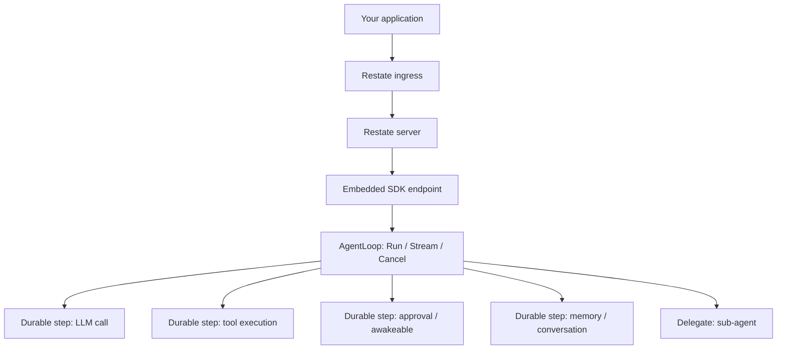

The Restate runtime executes agent runs as **durable Restate invocations**. Tool calls, LLM rounds, and approvals survive process crashes and deploys — Restate records durable steps and resumes from the last completed step.

Enable it by importing [`pkg/agent/runtime/restate`](https://pkg.go.dev/github.com/agenticenv/agent-sdk-go/pkg/agent/runtime/restate) and passing [`restate.WithRestateConfig`](/getting-started/configuration) to [`NewAgent`](/getting-started/quickstart). A running Restate server is required.

## Prerequisites

**Local development** — pick one:

| Approach | Command |
|---|---|
| **Docker** | `docker run --rm -p 8080:8080 -p 9070:9070 -p 9071:9071 --add-host=host.docker.internal:host-gateway docker.restate.dev/restatedev/restate:latest` |
| **Restate binary** | Install via [Install Restate](https://docs.restate.dev/installation), then `restate-server` |
| **Examples Compose** | From `examples/`: `task infra:restate:up` then `task infra:restate:wait` |

Ingress is at `http://localhost:8080`; Admin / UI at http://localhost:9070. Full local and production notes: [restate-setup.md](https://github.com/agenticenv/agent-sdk-go/blob/main/restate-setup.md) in the repository.

**Production** — use [Restate Cloud](https://docs.restate.dev/cloud) or a [self-hosted](https://docs.restate.dev/server/deploy/docker) cluster. Pass `Ingress.AuthKey` and optional `Endpoint.IdentityPublicKeys` as required by your deployment.

## Enable

### WithRestateConfig

```go
import (
    "github.com/agenticenv/agent-sdk-go/pkg/agent"
    "github.com/agenticenv/agent-sdk-go/pkg/agent/runtime/restate"
)

a, err := agent.NewAgent(
    restate.WithRestateConfig(&restate.RestateConfig{
        Ingress: restate.IngressConfig{
            URL: "http://localhost:8080",
        },
        Endpoint: restate.EndpointConfig{
            ListenAddress: ":9080",
            AdminURL:      "http://localhost:9070", // optional auto-register
        },
        EventLog: restate.EventLogConfig{DisableClear: true}, // examples / short-lived processes
    }),
    agent.WithLLMClient(llmClient),
    agent.WithSystemPrompt("You are a helpful assistant."),
)
if err != nil {
    return err
}
defer a.Close()
```

### IngressConfig fields

| Field | Purpose |
|---|---|
| `URL` | Restate ingress base URL (required) — e.g. `http://localhost:8080` |
| `AuthKey` | Optional bearer token for authenticated ingress (e.g. Restate Cloud) |
| `HTTPTimeout` | Per-attempt timeout for short ingress RPCs (default 30s) |
| `HTTPMaxAttempts` | Retry budget for transient ingress failures (default 3) |

### EndpointConfig fields

| Field | Purpose |
|---|---|
| `ListenAddress` | Bind address for the embedded SDK endpoint (default `:9080`) |
| `AdminURL` | When set, the runtime registers this endpoint with Restate admin after listen |
| `DeploymentURL` | URL Restate uses to call back into this process. Empty defaults to `http://127.0.0.1` + listen port. Override when Restate runs in Docker (e.g. `http://host.docker.internal:9080`) |
| `IdentityPublicKeys` | Optional Restate request-identity keys to verify inbound requests |

### EventLogConfig fields

Controls post-run cleanup of the per-run `AgentEventLog` virtual object. After a root `Run`/`Stream` finishes, the runtime schedules a delayed `Clear` so readers can drain first.

| Field | Purpose |
|---|---|
| `DisableClear` | When `true`, skip scheduling `Clear` (default `false` = cleanup on). Use for short-lived CLI examples that exit before delayed Clear can run. |
| `TTL` | Delay after the root run completes before `Clear`. Used only when cleanup is enabled. Zero defaults to **90s**. |

```go
// Defaults: cleanup on, 90s TTL
EventLog: restate.EventLogConfig{}

// Short-lived example — avoid Clear retries after process exit
EventLog: restate.EventLogConfig{DisableClear: true}

// Custom delay when cleanup is on
EventLog: restate.EventLogConfig{TTL: 2 * time.Minute}
```

`NewAgent` starts an **embedded SDK endpoint** in your process. Restate calls into that endpoint to run the agent loop.

<Warning>
Provide **either** Temporal options (`pkg/agent/runtime/temporal`) **or** `restate.WithRestateConfig`, not both. Mixing durable backends is a configuration error.
</Warning>

## Architecture

Restate splits agent execution into an ingress plane and an embedded endpoint:



| Component | Role |
|---|---|
| **Ingress** | Your application uses this to start runs via `Run` or `Stream`, cancel, and resolve awakeables |
| **Restate server** | Durable journaling and invocation routing |
| **Embedded SDK endpoint** | HTTP endpoint in your process that serves `AgentLoop` for Restate to invoke |
| **Durable steps** | Side effects and I/O — LLM calls, tool execution, MCP calls, memory I/O. Retries apply at the Restate step boundary |
| **Awakeables** | Approvals and other external wait points — resume when the client resolves them |
| **PubSub (`AgentEventLog`)** | Durable, ordered event log for streaming with offset reconnect |

<Note>
Restate topology is **ingress + embedded SDK endpoint**: the agent loop runs in your process when Restate invokes the registered deployment. Scale by registering multiple deployments; Restate routes invocations to them. For Temporal’s task-queue + worker model, see [Temporal runtime](/runtimes/temporal) and [Distributed Execution](/advanced/distributed-execution).
</Note>

## Durable execution

Because every agent run is a Restate durable invocation:

- **Process crashes do not lose progress** — completed steps are not re-executed; given approvals are not re-requested
- **Deploys are safe** — restart the process; Restate resumes from recorded journal entries
- **Runs outlive the client attach** — the invocation continues in Restate even if your subscriber disconnects
- **`Close` does not terminate invocations** — calling `Agent.Close()` shuts down the local SDK endpoint and owned connections; in-flight invocations keep running and resume when an endpoint is available again

See [Durable Execution](/advanced/durable-execution) for the shared `GetAgentRun` / `GetAgentStream` reconnect protocol.

## Topology

Production topology is:

1. Run Restate (Cloud or self-hosted)
2. Run one or more agent processes with `restate.WithRestateConfig` (each embeds an SDK endpoint)
3. Register deployments (automatic when `AdminURL` is set, or via the Restate admin/CLI)

Streaming and approvals work with no extra configuration — the agent attaches through Restate ingress, independent of which registered endpoint executes the invocation.

## Streaming and approvals

Events are delivered through a Restate **PubSub** virtual object (`AgentEventLog`) — a durable, ordered event log. Every published event is appended with a monotonic offset; subscribers receive the same events in the same order.

**Delivery model:**

| Property | Value |
|---|---|
| **Durability** | Event log lives in Restate; survives process crashes and restarts |
| **Delivery** | Subscribers attach via ingress; events are forwarded with offset tracking |
| **Terminal events** | A terminal `RUN_FINISHED` or `RUN_ERROR` event is always delivered before the channel closes |
| **Offset** | Each event carries an `Offset()` accessible via the stream forwarder; use it to resume after disconnect |
| **Reconnect** | After a process crash or disconnect: `GetAgentStream` + `WithOffset` for streams, or `GetAgentRun` for non-stream `Run` |
| **Approvals** | Stream path uses CUSTOM events + awakeable resolve; `Run` path uses `WithApprovalHandler` |

**After a disconnect — stream reconnect with `GetAgentStream`:**

```go
// Save runID and offset during normal streaming.
agentStream, err := a.Stream(ctx, prompt, nil)
runID := agentStream.ID()
eventCh, err := agentStream.Events(ctx)
for ev := range eventCh {
    if ob, ok := ev.(interface{ Offset() (int64, bool) }); ok {
        if off, has := ob.Offset(); has {
            saveOffset(runID, off) // persist before processing each event
        }
    }
    handleEvent(ev)
}

// On process restart: reconnect from last saved offset.
savedRunID, savedOffset := loadSavedRun()
agentStream, err = a.GetAgentStream(ctx, savedRunID)
resumeCh, err := agentStream.Events(ctx, agent.WithOffset(savedOffset))
```

<Note>
Always persist the runID and offset **before** processing each event. If your process crashes between reading an event and saving its offset, you will replay only that event on reconnect, never lose progress beyond it.
</Note>

**After a disconnect — run reconnect with `GetAgentRun`:**

```go
// Save runID immediately after Run — before Get / Done.
agentRun, err := a.Run(ctx, prompt, nil)
saveRunID(agentRun.ID())

// On process restart: reconnect and wait for the result.
run, err := a.GetAgentRun(ctx, loadSavedRunID())
if errors.Is(err, agent.ErrRunAlreadyCompleted) {
    // Invocation finished while disconnected — use conversation/memory.
    return
}
result, err := run.Get(ctx) // or <-run.Done() then Get
```

See [Durable Execution](/advanced/durable-execution) for run + stream recovery, and [Approvals](/features/approvals) for approval events on stream.

## Agent mode

[`WithAgentMode`](/getting-started/configuration) tells the runtime how to treat the run. `AgentModeInteractive` (default) is for user-facing apps with short, bounded sessions. `AgentModeAutonomous` is for background jobs and long-running pipelines. See [Timeouts & Modes](/advanced/timeouts-and-modes).

## Sub-agents on Restate

Each specialist is a normal Restate agent: its own `AgentLoop_<name>`, `AgentEventLog_<name>`, and listen port (unique when co-located). The parent invokes the child's `AgentLoop` service; when delegated, the child publishes stream events to the parent's `AgentEventLog` (same idea as Temporal's `RootWorkflowID`). Give each agent a distinct `Endpoint.ListenAddress` / `DeploymentURL`. See [Sub-agents](/features/sub-agents).

## Examples

<CardGroup cols={2}>

  <Card title="Durable Agent (Restate)" icon="shield" href="/examples/durable-agent-restate" horizontal>
    Single-process crash lab and reconnect
  </Card>

  <Card title="Durable Execution" icon="shield" href="/advanced/durable-execution" horizontal>
    Crash recovery and GetAgentRun / GetAgentStream
  </Card>

  <Card title="Running Examples" icon="terminal" href="/examples/running-examples" horizontal>
    Set AGENT_RUNTIME=restate and start Restate infra
  </Card>
</CardGroup>
